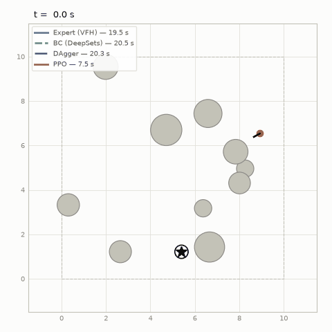
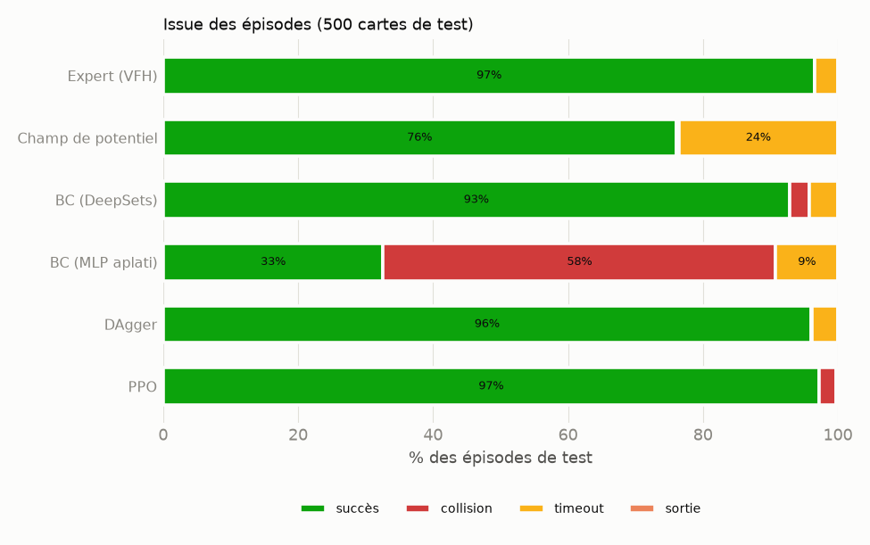
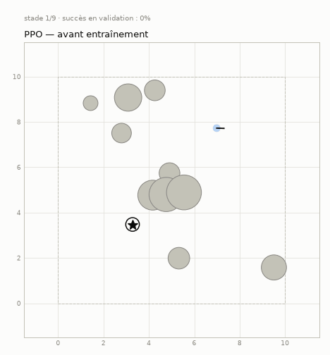
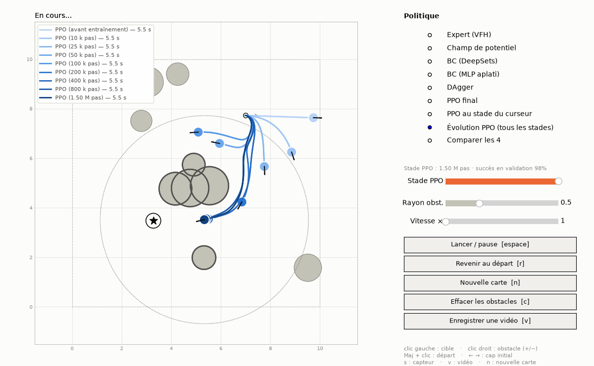
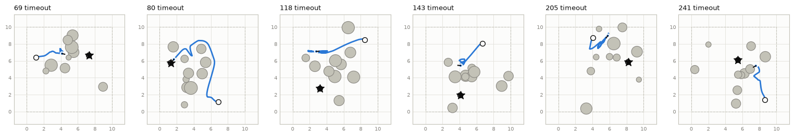
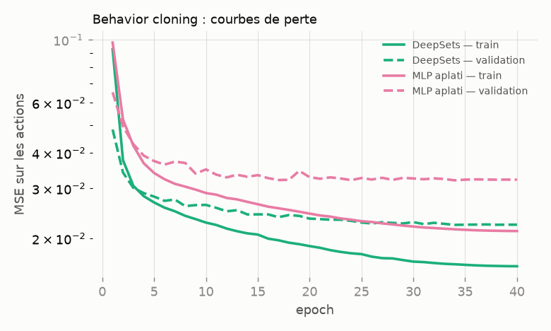
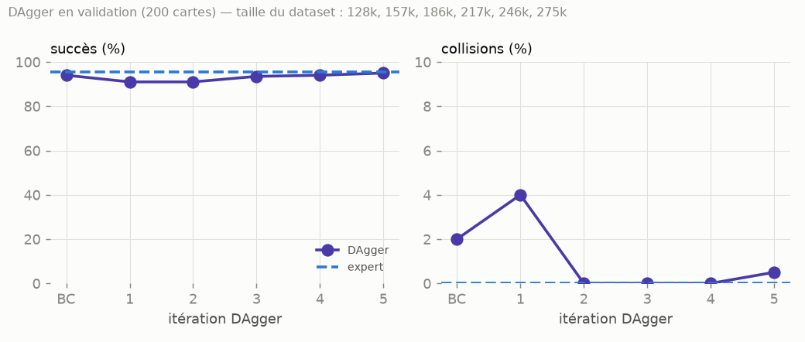
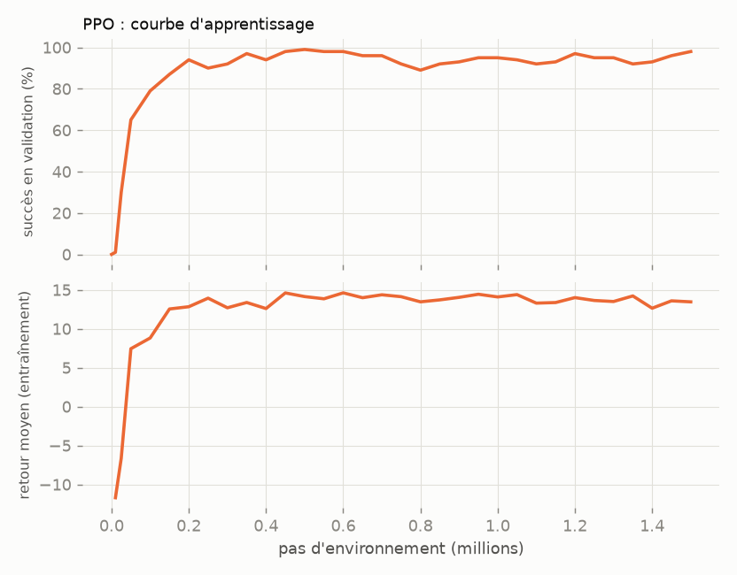
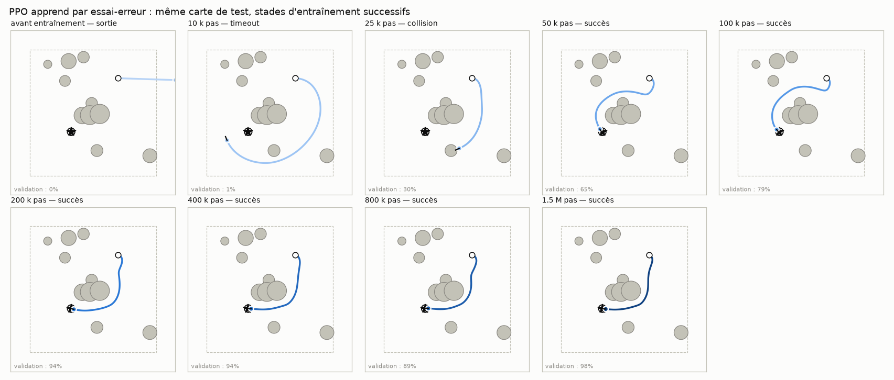

# robot-learn — expert, imitation ou essai-erreur ?

Un robot à deux roues (vue du dessus) doit rejoindre une cible au milieu d'obstacles.
On compare trois façons de lui apprendre ce comportement, **sur les mêmes 500 cartes de test** :

| | Comment la politique est obtenue | Voit l'expert ? |
|---|---|---|
| **Expert** | contrôleur écrit à la main (Vector Field Histogram) | — |
| **Behavior cloning (+ DAgger)** | réseau PyTorch entraîné à imiter l'expert (apprentissage supervisé) | oui |
| **PPO** | même réseau, entraîné par renforcement, uniquement avec une récompense | jamais |



## Résultats

500 cartes de test jamais vues à l'entraînement, identiques pour toutes les politiques (`python -m eval.benchmark`) :

| Politique | Succès | IC 95 % | Collision | Timeout | SPL | Durée moyenne (s) |
|---|---:|---:|---:|---:|---:|---:|
| Expert (VFH) | **96,6 %** | 95–98 % | 0,0 % | 3,4 % | 0,872 | 13,1 |
| Champ de potentiel *(1er essai d'expert)* | 76,0 % | 72–80 % | 0,4 % | 23,6 % | 0,660 | 10,4 |
| BC (DeepSets) | **92,8 %** | 90–95 % | 3,0 % | 4,2 % | 0,827 | 13,7 |
| BC (MLP aplati) *(ablation)* | 32,6 % | 29–37 % | 58,2 % | 9,2 % | 0,271 | 11,5 |
| DAgger | **96,0 %** | 94–97 % | 0,2 % | 3,8 % | 0,850 | 14,0 |
| PPO | **97,2 %** | 95–98 % | 2,6 % | 0,2 % | 0,784 | **8,6** |

*SPL* : succès pondéré par l'efficacité du chemin (1 = ligne droite). Durée : moyenne sur les épisodes réussis.
Tableau complet (marge aux obstacles, temps d'inférence) : [`results/benchmark.md`](results/benchmark.md).



**Ce qu'on en retient**

1. **Le BC imite bien, mais pas parfaitement** (92,8 % contre 96,6 %) : ses 3 % de collisions viennent de
   l'erreur composée — une petite déviation mène à un état que l'expert n'a jamais montré.
   **DAgger corrige exactement ça** : même réseau, mêmes données de départ, et on remonte au niveau de l'expert
   (96,0 %) avec quasiment plus de collisions (0,2 %).
2. **PPO égale l'expert sans jamais l'avoir vu** (97,2 %, intervalles de confiance qui se recouvrent) et arrive
   **35 % plus vite** (8,6 s contre 13,1 s). Il ne reste presque jamais bloqué (0,2 % de timeouts contre 3,4 %) :
   il n'hérite pas des culs-de-sac de l'heuristique VFH. En contrepartie il **prend plus de risques** (2,6 % de
   collisions) : la pénalité de temps le pousse à rouler à fond, un compromis réglé par la récompense.
3. **L'architecture compte autant que l'algorithme** : même données, même entraînement, taille comparable —
   l'encodeur DeepSets atteint 92,8 %, un MLP sur le vecteur aplati 32,6 %.
4. **Coût en données** : le BC utilise 129 k transitions de l'expert ; PPO a besoin de ~200 k transitions
   pour dépasser 90 % et de 1,5 M pour finir — sans aucune démonstration.

### PPO apprend par essai-erreur

Même carte de test, même réseau, rejoué à différents stades de l'entraînement : au début la politique
est aléatoire, puis elle apprend à avancer vers la cible, puis à contourner les obstacles.



**Vidéos MP4 (1280×720)** — générées par `python -m eval.learning_video --maps 3` :
- [`results/videos/ppo_evolution.mp4`](results/videos/ppo_evolution.mp4) — trois cartes de test ; à chaque stade,
  la courbe d'apprentissage à droite indique où en est le réseau, les essais précédents restent en gris ;
- [`results/videos/ppo_evolution_simultaneous.mp4`](results/videos/ppo_evolution_simultaneous.mp4) — tous les stades
  roulent en même temps sur la même carte.

Pour filmer tes propres cartes : touche **`v`** dans le simulateur (ci-dessous), la vidéo est écrite dans `results/videos/`.

### Jouer avec la simulation

```bash
python -m eval.play
```



Une fenêtre s'ouvre : **clic gauche** place la cible, **clic droit** ajoute (ou retire) un obstacle,
**Maj + clic** place le départ, **espace** lance le robot, **`v`** filme (MP4). Le panneau de droite permet de choisir la
politique, de **comparer** les quatre sur ta carte, ou de faire rouler **tous les stades d'entraînement de PPO
en même temps** (du plus clair, avant entraînement, au plus foncé, fin d'entraînement). Le curseur « Stade PPO »
charge la politique telle qu'elle était à un moment donné de l'apprentissage. Les obstacles cerclés sont ceux
que le robot « voit » réellement (les 5 plus proches dans un rayon de 4 m).

---

## Sommaire

1. [Résultats](#résultats)
2. [L'environnement](#lenvironnement)
3. [L'expert](#lexpert--champs-de-potentiel-puis-vfh)
4. [Le réseau : pourquoi DeepSets](#le-réseau--pourquoi-un-encodeur-deepsets)
5. [Behavior cloning et DAgger](#behavior-cloning-et-dagger)
6. [PPO](#ppo)
7. [ROS 2](#ros-2)
8. [Reproduire](#reproduire)
9. [Structure du dépôt](#structure-du-dépôt)
10. [Limites et pistes](#limites-et-pistes)

---

## L'environnement

`env/` — API [Gymnasium](https://gymnasium.farama.org/) (`reset` / `step`), rendu matplotlib, GIF.

- **Robot** : modèle cinématique unicycle (robot différentiel), rayon 20 cm,
  `v ∈ [0, 1] m/s` (marche avant), `ω ∈ [-2, 2] rad/s`, pas de temps 0,1 s, intégration au point milieu.
- **Scénario** : départ et cible distants d'au moins 5 m dans une zone de 10 × 10 m, 10 obstacles
  circulaires (rayon 0,3–0,8 m) dont 3 placés près de la ligne droite pour forcer l'évitement.
  Un *flood-fill* sur grille rejette les cartes sans chemin : un échec mesuré est toujours imputable à la politique.
- **Observation** (28 valeurs, **dans le repère du robot**) : distance et direction de la cible,
  puis les 5 obstacles les plus proches dans un rayon de 4 m (position relative, distance de surface,
  rayon, masque de présence). Pas d'image : c'est un problème de décision, pas de perception.
- **Action** normalisée dans `[-1, 1]²` → `(v, ω)`.
- **Fin d'épisode** : cible atteinte (< 30 cm), collision, sortie de zone (> 1,5 m du bord) ou 30 s écoulées.
- **Graines disjointes** (`env/seeds.py`) : démonstrations, rollouts DAgger, validation et test
  n'utilisent jamais les mêmes cartes.

## L'expert : champs de potentiel, puis VFH

`expert/` — il sert de **référence chiffrée** et de **source des démonstrations**. Il ne lit que le
vecteur d'observation : l'élève dispose donc exactement de la même information que le professeur
(un expert « omniscient » rendrait une partie de ses décisions impossibles à imiter).

1. **Champs de potentiel** (`potential_field.py`) : attraction vers la cible + répulsion + composante
   tangentielle pour contourner. **74 %** de succès : devant un amas d'obstacles concave, les forces
   s'annulent et le robot reste bloqué (minimum local) — la limite classique de la méthode.
2. **Vector Field Histogram** (`vfh.py`) : on teste 72 directions candidates, on élimine celles dont le
   segment de 2,5 m touche un obstacle gonflé (rayon robot + 20 cm), et on prend la direction libre la plus
   proche de la cible. Un premier essai oscillait quand la cible était derrière le robot (deux trouées
   symétriques, le choix basculait à chaque pas) : la grille est désormais ancrée sur la direction de la
   cible et un biais vers le cap actuel rend le choix auto-renforçant. **97 %** de succès, **0 collision**.



## Le réseau : pourquoi un encodeur DeepSets

`models/networks.py` — le **même encodeur** sert au BC et à PPO, donc l'écart mesuré entre les deux vient de
l'algorithme d'apprentissage, pas de l'architecture.

```
cible (3) ─────────── MLP 3→64→64 ──────────────┐
                                                ├─ concat (128) → Linear 128→128 → ReLU → tête 128→64→2
obstacles (5×5) → φ partagé 4→64→64 → max-pool ─┘        (emplacements vides masqués)
```

| Choix | Pourquoi |
|---|---|
| **φ partagé + max-pool** (DeepSets) | Les obstacles sont un *ensemble*. Triés par distance, ils échangent leur rang dès que deux distances se croisent : un MLP sur le vecteur aplati voit alors ses entrées permuter brutalement alors que la scène n'a pas changé. Ici la sortie est invariante par permutation par construction (vérifié par un test). |
| **Partage de poids** | φ apprend « ce qu'est un obstacle dangereux » une fois, au lieu d'une fois par position dans le vecteur. |
| **Max plutôt que moyenne** | Pour éviter une collision, c'est l'obstacle le plus critique qui compte ; la moyenne serait diluée par les obstacles lointains et les emplacements vides. |
| **Masque** | Le nombre d'obstacles visibles varie (0 à 5) ; les emplacements vides n'influencent pas la sortie. |
| **Tête linéaire + écrêtage** plutôt que `tanh` | L'expert roule souvent à vitesse max (a = +1) : avec `tanh`, atteindre ±1 exige une pré-activation infinie et le gradient s'écrase. |
| **~34 k paramètres** | Problème de faible dimension ; plus gros = sur-apprentissage des démonstrations et PPO plus lent sur CPU. |

**Ablation** (même données, même entraînement, taille comparable) :

| Encodeur | Paramètres | MSE validation | Succès (500 cartes de test) | Collisions |
|---|---:|---:|---:|---:|
| **DeepSets** (retenu) | 33,8 k | **0,022** | **92,8 %** | 3,0 % |
| MLP aplati | 28,6 k | 0,032 | 32,6 % | 58,2 % |
| MLP aplati, 3× plus large | 89,8 k | 0,033 | 34,5 %* | 62,0 %* |

\* sur 200 cartes de validation ; le résultat est stable d'une graine d'entraînement à l'autre (31,5 % avec une autre graine).



L'écart de perte de validation est modeste (0,022 vs 0,032), mais en **boucle fermée** il explose :
chaque petite erreur amène le robot dans un état un peu moins familier, où le MLP aplati — dont la sortie
saute quand l'ordre des obstacles change — se trompe davantage.

## Behavior cloning et DAgger

`bc/` — 1 000 épisodes de l'expert (129 k paires état-action, épisodes ratés exclus), régression MSE,
Adam + cosinus, découpage train/validation **par épisode** (deux pas consécutifs sont quasi identiques :
les mélanger gonflerait la validation).

Le BC ne voit que les états visités par l'expert. Dès que l'élève dévie, il entre dans des états jamais vus :
c'est le *covariate shift*, dont l'erreur croît en O(T²). **DAgger** (Ross et al., 2011) fait rouler la
politique apprise, demande à l'expert la bonne action dans chaque état réellement visité, agrège et réentraîne.
C'est possible parce que l'expert est un programme interrogeable partout — pas le cas avec un humain.



## PPO

`rl/` — [Stable-Baselines3](https://stable-baselines3.readthedocs.io/) avec `NavEncoder` comme
extracteur de features (`rl/features.py`), acteur et critique avec chacun leur encodeur. PPO ne voit jamais l'expert.

**Récompense** (`env/config.py::RewardConfig`) :

| Terme | Valeur | Rôle |
|---|---|---|
| Progrès | +1 / m gagné vers la cible | shaping par potentiel (Ng et al., 1999) : signal dense, politique optimale inchangée |
| Succès | +10 | terminal |
| Collision / sortie | −10 | terminal, du même ordre que le gain de progrès total : foncer dans un obstacle n'est jamais rentable |
| Temps | −0,01 / pas | départage deux trajets sûrs |
| Proximité | jusqu'à −0,1 / pas sous 30 cm | apprend une marge de sécurité avant de découvrir la collision |

Hyperparamètres principaux : 8 environnements × 512 pas par mise à jour, 10 epochs, lot de 256,
lr 3·10⁻⁴, γ = 0,99, λ = 0,95, `log_std_init = −0,5`, récompenses normalisées. La meilleure politique
(succès sur 100 cartes de validation) est exportée vers le format de checkpoint commun (`rl/export.py`,
équivalence exacte avec SB3 vérifiée par un test).



Pendant l'entraînement, `rl/train.py` sauvegarde des **instantanés** de la politique à des étapes espacées
de façon logarithmique (0, 10 k, 25 k, 50 k, 100 k, 200 k, 400 k, 800 k pas, fin) dans
`checkpoints/ppo_snapshots/` — c'est au début que le comportement change le plus. `python -m eval.learning_progress`
rejoue ces instantanés sur une même carte de test (GIF ci-dessus et figure ci-dessous) ; le simulateur interactif
permet de les faire rouler sur n'importe quelle carte.



## ROS 2

`ros2/robot_learn_ros/` — package `ament_python` pour ROS 2 Jazzy :

- **`policy_node`** : `/odom` + `/goal_pose` + `/obstacles` (MarkerArray) → `/cmd_vel` à 10 Hz.
  L'observation est construite par **la même fonction** qu'à l'entraînement (`env/observation.py`), le réseau
  est chargé depuis le checkpoint commun (pas besoin de SB3). Arrêt de sécurité si l'odométrie est périmée.
- **`sim_node`** : le même modèle cinématique exposé en ROS 2 (odométrie, TF, obstacles, trajectoire pour
  RViz), enchaîne les cartes de test et publie l'issue de chaque épisode.
- **`demo.launch.py`** : les deux ensemble, en boucle fermée.

```bash
docker build -f docker/ros2.Dockerfile -t robot-learn-ros2 .
docker run --rm robot-learn-ros2   # 10 épisodes avec PPO
```

Résultat dans le conteneur ROS 2 Jazzy avec la politique PPO : **10 épisodes sur 10 réussis** sur les cartes de test.
Autre politique : `docker run --rm robot-learn-ros2 ros2 launch robot_learn_ros demo.launch.py policy:=/robot-learn/checkpoints/dagger.pt`
(ou `policy:=expert`). Les topics `/obstacles`, `/path`, `/goal_pose` et la TF `odom → base_link` s'affichent dans RViz.

Sur un vrai robot, `/obstacles` viendrait d'un module de perception (lidar + clustering) et `/odom` des encodeurs de roues.

## Reproduire

```bash
python -m venv .venv && source .venv/bin/activate      # Windows : .venv\Scripts\activate
pip install torch --index-url https://download.pytorch.org/whl/cpu
pip install -e ".[dev]"

python -m env.demo_random                 # S1 : épisode aléatoire -> results/random_policy.gif
python -m expert.evaluate --n 500 --gif   # S2 : succès de l'expert
python -m bc.train --arch deepsets        # S3 : BC (collecte les démonstrations au premier lancement)
python -m bc.train --arch mlp             #      ablation
python -m bc.dagger                       #      DAgger
python -m rl.train --subproc              # S4 : PPO, 1,5 M pas, avec instantanés d'apprentissage
python -m eval.benchmark                  # S5 : tableau comparatif sur 500 cartes de test
python -m eval.visualize                  #      GIF de comparaison
python -m eval.learning_progress          #      évolution de PPO pendant l'entraînement (GIF + figure)
python -m eval.learning_video --maps 3    #      la même chose en vidéos MP4
python -m eval.play                       #      simulateur interactif
pytest                                    # tests
```

Les checkpoints finaux sont versionnés dans `checkpoints/` : `eval.benchmark` et `eval.visualize` fonctionnent sans réentraîner.

Temps indicatifs sur un portable (CPU 16 threads, pas de GPU) : démonstrations + BC ≈ 4 min, DAgger ≈ 17 min,
PPO 1,5 M pas ≈ 50 min, benchmark ≈ 3 min.

## Structure du dépôt

```
env/          modèle cinématique, scénarios, observation, récompense, rendu, API Gymnasium
expert/       champs de potentiel (essai) et VFH (expert retenu)
models/       encodeur DeepSets, MLP d'ablation, format de checkpoint commun
bc/           collecte des démonstrations, behavior cloning, DAgger
rl/           PPO (SB3) avec extracteur de features personnalisé, export
eval/         métriques, benchmark, GIF de comparaison, évolution de l'apprentissage, simulateur interactif
ros2/         package ROS 2 (policy_node, sim_node, launch)
docker/       images entraînement/évaluation et ROS 2 Jazzy
tests/        tests unitaires (API Gymnasium, cinématique, invariance du réseau, export PPO…)
checkpoints/  politiques entraînées
results/      figures, GIF, tableaux
```

## Limites et pistes

- **Monde idéalisé** : modèle cinématique (ni inertie ni glissement), obstacles ronds, statiques et perçus
  sans bruit. Piste : bruit de capteur et *domain randomization*, puis passage à Gazebo via le nœud ROS 2 existant.
- **Observation locale** (5 obstacles, 4 m) : les culs-de-sac plus larges que la portée du capteur piègent
  l'expert (ses 3 % de timeouts) et le BC en hérite. Une petite mémoire (LSTM) ou une carte locale aiderait.
- **Collisions de PPO** (2,6 %) : pénalité de collision plus forte, RL sous contrainte (PPO-Lagrangien) ou
  filtre de sécurité (*safety shield*) qui reprend la main près des obstacles.
- **Sélection de modèle** : le meilleur PPO est choisi sur 100 cartes de validation ; les chiffres ci-dessus
  viennent de 500 cartes de test distinctes, donc non biaisés par cette sélection.
- **Une seule graine d'entraînement** pour PPO et DAgger ; plusieurs graines donneraient des barres d'erreur
  sur les courbes d'apprentissage.
- Pistes d'extension : lidar brut (encodeur Conv1D) à la place des obstacles extraits, obstacles mobiles,
  initialiser PPO avec le BC puis l'affiner (*BC + RL fine-tuning*).
